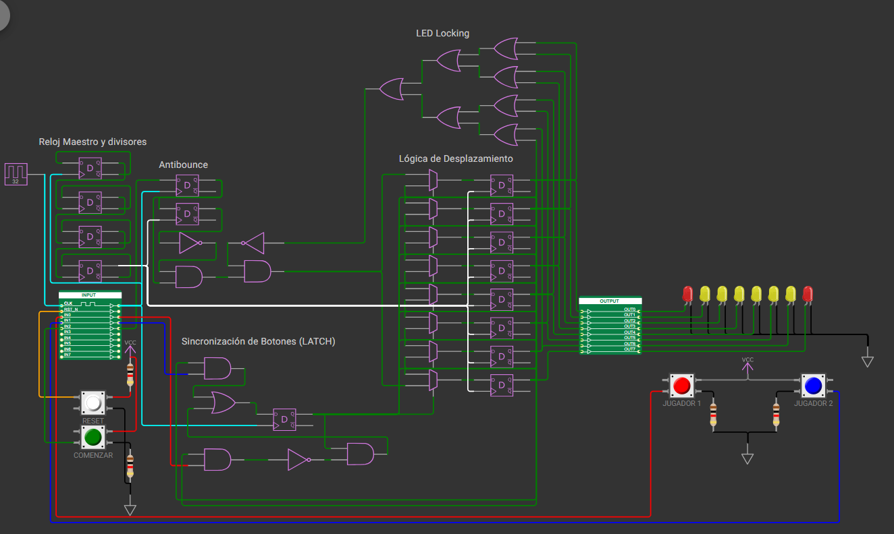

   

# 1D Pong Game - Wokwi - Tiny Tapeout

- [Read the official documentation for this project](docs/info.md)
- [Preview the project in Wokwi](https://wokwi.com/projects/474661495515425793)

## Overview

This design is a fundamental 1D Pong game built entirely with digital logic gates and flip-flops. The inputs consist of three main buttons (Player 1, Player 2, and Start), and the output is displayed across a row of 8 LEDs. When a game begins, a single LED lights up to represent the ball. Players must press their respective buttons at the exact right moment to bounce the ball back and avoid losing.

## How It Works

The design relies on several distinct functional blocks working together:

### Bidirectional Shift Register (Ball Movement Logic)
The core of the game is a bidirectional shift register built using D-type Flip-Flops and 2-to-1 Multiplexers. A single active bit (the ball) shifts sequentially across the Flip-Flop outputs. By toggling the multiplexers' select line, the system dictates whether the Flip-Flops listen to their left or right neighbor, effectively changing the ball's shifting direction.

### Anti-Bounce & Edge Detection
To prevent erratic behavior, an anti-bounce circuit is implemented using two Flip-Flops and logic gates. This acts as an edge detector, ensuring that even if the 'Start' button is held down, only a single, clean pulse is generated. This prevents the system from spawning multiple balls simultaneously.

### Game State Interlock (LED Monitoring)
An expansive OR-gate tree continuously monitors the state of all 8 LEDs. This acts as a hardware interlock: it guarantees that the 'Start' button is completely disabled as long as there is an active ball already in play on the LED row.

### Clock Domain Partitioning
To make the system highly responsive while keeping the game playable, the architecture is divided into two clock domains: a 32 Hz Master Clock and a 2 Hz Game Clock.
* **User Experience (32 Hz):** The master frequency drives the anti-bounce logic and button synchronization. This high polling rate ensures that the hardware catches fast button presses instantly, meaning players don't have to hold down the buttons to register a hit.
* **Game Speed (2 Hz):** The LED shift logic operates on the slower 2 Hz clock, moving the ball at a speed that human reflexes can actually track and react to.
* **Clock Divider Implementation:** To derive the 2 Hz signal from the 32 Hz master clock, four D Flip-Flops are cascaded in a toggle configuration. Each Flip-Flop divides the incoming frequency by half, successfully achieving the target frequency (32 Hz / 2^4 = 2 Hz).

*(Note: Future versions could implement dynamic frequency scaling to gradually increase the game clock speed, making the gameplay more competitive).*

### Direction Control (1-Bit FSM)
This block handles the bounce logic based on player reaction. First, it verifies that the ball is positioned at the exact edge of the player's side when their button is pressed. These impact signals are fed into a synchronous Latch (a 1-Bit Finite State Machine built around a D Flip-Flop). Based on the players' inputs and its current internal state, the FSM updates the ball's direction and securely memorizes it until the next valid hit is registered.

*(Note: A Reset Button is present in the pinout, but its logic is not implemented in this current version).*

## How to Test

1. Press the **Start** button to serve the ball onto the LED array.
2. Watch the active LED move across the board.
3. Use the **Player 1** and **Player 2** buttons to strike the ball exactly when it reaches your respective edge. 
4. If you miss, the ball will fall off the edge and the game ends. 

*This game is best experienced with two players facing off against each other!*

## External Hardware

* 3x Mechanical Push Buttons
* 8x LEDs (with appropriate current-limiting resistors)

---

## What is Tiny Tapeout?

Tiny Tapeout is an educational project that aims to make it easier and cheaper than ever to get your digital and analog designs manufactured on a real chip.

To learn more and get started, visit [tinytapeout.com](https://tinytapeout.com).

## Resources

- [FAQ](https://tinytapeout.com/faq/)
- [Digital design lessons](https://tinytapeout.com/digital_design/)
- [Learn how semiconductors work](https://tinytapeout.com/siliwiz/)
- [Join the community](https://tinytapeout.com/discord)
- [Build your design locally](https://www.tinytapeout.com/guides/local-hardening/)
